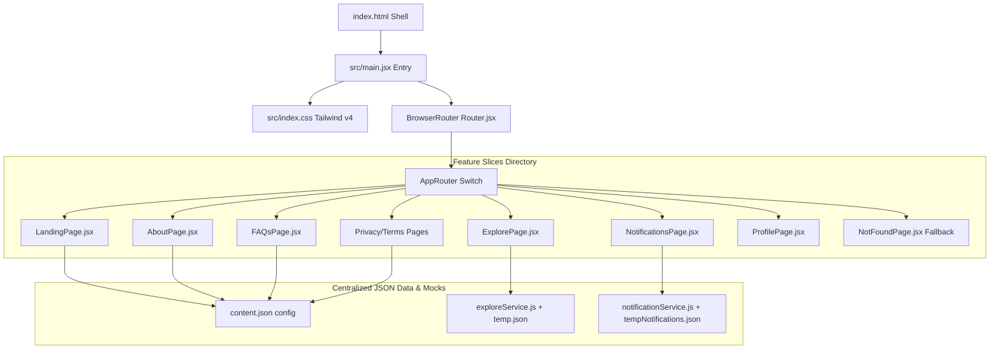

# Neargrab Frontend Architecture Guide

This document explores the architectural design and structural patterns of the Neargrab frontend web application. It is targeted at developers wishing to understand the underlying data and layout flow, compilation models, and component boundaries.

---

## 🏗️ Tech Stack Architecture

The Neargrab frontend is engineered on a modern, ultra-responsive foundation:



### Stack Components

1.  **Vite 8 (Build System)**: Serves native ESM during development, resulting in near-instantaneous hot reloads (HMR). Performs rolling production builds with tree-shaking, automated chunking, and CSS compression.
2.  **React 19 (Component Library)**: Employs functional components, custom hooks, and Strict Mode hooks for performance and thread safety.
3.  **Tailwind CSS v4 (Styling Framework)**: Incorporates a high-performance CSS compiler that is fully integrated into the Vite build pipelining via `@tailwindcss/vite`, avoiding post-processing overhead.
4.  **React Router DOM v7 (Routing Platform)**: Handles lightning-fast, zero-reloading client-side routes, resolving history buffers, scrolling anchors, and layout switching.
5.  **Class Merging Utility (`src/shared/utils/cn.js`)**: Leverages `clsx` and `tailwind-merge` to compile clean, conditional, and conflict-free utility overrides dynamically for high-fidelity responsive components.

---

## 🗂️ Architectural Concept: Feature Slices & Mock Data Handlers

To prevent the common React issue where directories become cluttered as files accumulate, Neargrab uses a **Feature Slice Pattern** (simplified variant of Feature-Sliced Design).

### Principles of our Feature Slices:

*   **Self-Contained Slices**: All assets, components, layouts, data objects, and helpers supporting a business concept are encapsulated inside its matching feature directory (e.g. `src/features/landing/`, `src/features/notifications/`).
*   **Decoupled Pages**: Route screens (e.g., `AboutPage.jsx`, `NotificationsPage.jsx`) live inside a slice's `pages/` subdirectory. They behave as orchestrators, importing specific widgets from `components/` and feeding them details extracted from configuration files or service handlers.
*   **Asynchronous Mock Services Pattern**: Dashboard queries (e.g., `notificationService.js`, `exploreService.js`) mimic production backend behaviors by loading mock JSON schemas asynchronously. They leverage state cache stores and simulated latency timeouts to yield authentic loading loaders, spinner cues, and dynamic states!
*   **Shared Assets boundary**: The `src/shared/` folder contains layouts, utils, or components that cross domain boundaries (like global navigation headers or star ratings).

---

## 🔗 Decoupled Component Patterns

A critical architectural pattern in Neargrab is the strict separation of **Presentation (JSX)** and **Copy/Content (JSON)**.

```text
[content.json Central Model] 
       │
       ▼ (Direct Import)
[Page Component (e.g., FAQsPage.jsx)]
       │
       ├─► Passes FAQ Categories array ──► [FAQCategories.jsx]
       ├─► Passes Active Item ID ────────► [FAQAccordion.jsx]
       └─► Passes Support Contact Object ─► [FAQContact.jsx]
```

### Architectural Benefits:
1.  **Cleaner Presentational Markup**: JSX files do not contain thousands of lines of hardcoded HTML text string arrays. Instead, they focus purely on styles, states, and responsive layouts.
2.  **Instant Content Adjustments**: Non-technical team members or copywriters can alter spelling, values, and structural links by editing a single JSON schema.
3.  **Zero-Configuration Multi-Language Support**: centralizing text makes integrating future Internationalization (i18n) libraries as simple as loading a localized JSON file based on client locale.

---

## 🎨 Tailwind CSS v4 Engine Configuration

Neargrab leverages the brand-new Tailwind CSS v4 structure. Notable architectural changes include:

*   **CSS-First Configuration**: The legacy `tailwind.config.js` is deleted. All configuration parameters, keyframe setups, and theme declarations are handled directly inside `src/index.css`.
*   **Theme Integration**: Standard Tailwind utility bindings are declared using the `@theme` directive, which automatically exports CSS properties as Tailwind classes:
    ```css
    @theme {
      --color-brand-900: var(--color-brand-900);
      /* Custom properties bind seamlessly */
    }
    ```
*   **Base Directives**: HTML element adjustments are separated cleanly inside `@layer base {}` declarations, preventing custom base declarations from leaking globally.
